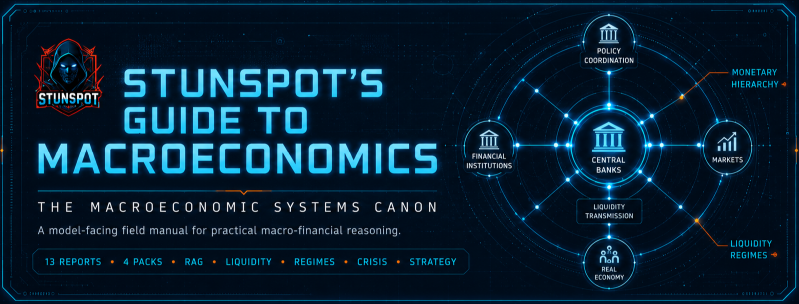

<p align="center">
  
</p>

# Stunspot’s Guide to Macroeconomics

**A model-facing macroeconomics canon for monetary systems, liquidity regimes, financial instability, and institutional strategy.**


*Stunspot’s Guide to Macroeconomics* is a Markdown-native knowledge canon by Sam “stunspot” Walker, built primarily for AI/RAG ingestion rather than casual textbook reading.

Its main audience is the model.

When loaded into an AI workspace, retrieval pipeline, project knowledge base, long-context session, agent memory layer, or NotebookLM-style research environment, the guide gives the assisting model a structured macro-financial substrate: monetary ontology, liquidity mechanics, credit creation, central-bank operations, fiscal constraint dynamics, global currency hierarchy, asset-pricing regimes, narrative liquidity, crisis propagation, regime diagnostics, and institutional action logic.

Human readers can use it as a field manual. The deeper purpose is practical augmentation: to make AI systems better at reasoning about macroeconomic structure, financial-system plumbing, policy transmission, market regimes, institutional vulnerability, and the difference between isolated indicators and decision-relevant economic signals.

At its core is a simple systems premise:

> Macroeconomics is not a set of disconnected indicators. It is a layered operating system of money, credit, collateral, liquidity, institutional balance sheets, expectations, policy constraints, and narrative coordination. Good macro reasoning means identifying the active regime, tracing the transmission channels, and converting signals into usable strategic judgment.

Use it as reference material.  
Use it as RAG substrate.  
Use it as project knowledge.  
Use it as doctrine for AI agents tasked with explaining, critiquing, stress-testing, or applying macroeconomic intelligence.

---

## Start Here

- [Canon Map](./docs/canon-map.md)
- [How to Use This Canon](./docs/how-to-use-this-canon.md)
- [Knowledge Packs](./docs/knowledge-packs.md)
- [Manifest](./MANIFEST.md)
- [Status](./STATUS.md)

---

## Corpus Shape

This repository separates navigation from corpus files.

| Area | Path | Role |
|---|---|---|
| Public guides | [`docs/`](./docs/) | GitHub Pages navigation, orientation, and usage guidance. |
| Source reports | [`knowledge-packs/by-report/`](./knowledge-packs/by-report/) | The 13 canonical individual reports. Best for selective ingestion, citation, and editing. |
| Compiled packs | [`knowledge-packs/compiled-packs/`](./knowledge-packs/compiled-packs/) | Four grouped upload packs. Recommended default for most AI/RAG workflows. |
| Omnibus | [`knowledge-packs/omnibus/`](./knowledge-packs/omnibus/) | One whole-corpus bundle for systems that handle large single-file context well. |

`docs/` is not the report corpus. It is the navigation and guidance layer. Individual source reports live in `knowledge-packs/by-report/`; compiled upload packs live in `knowledge-packs/compiled-packs/`; the whole-corpus bundle lives in `knowledge-packs/omnibus/`.

---

## What This Canon Covers

The canon is organized across **13 reports**, from **A** through **M**.

It covers:

- monetary hierarchy, settlement assets, inside money, credit-money, collateral, and financial abstraction
- liquidity creation, destruction, transmission, and global dollar funding mechanics
- macro-causal architecture, regime shifts, endogenous instability, and structural transitions
- central banking systems, policy instruments, reserves, QE/QT, swap lines, and dealer-of-last-resort functions
- fiscal states, sovereign debt, public balance sheets, debt sustainability, and political capital allocation
- banking systems, credit allocation, intermediation, shadow banking, and balance-sheet constraints
- asset pricing regimes across equities, bonds, real estate, commodities, venture markets, and liquidity-sensitive assets
- global trade systems, reserve-currency hierarchy, geoeconomic power, and external-sector constraint
- innovation finance, venture liquidity, and speculative capital formation
- information liquidity, narrative markets, attention allocation, and public-reality formation
- financial instability, crisis cascades, contagion dynamics, and systemic collapse mechanics
- macro diagnostics, regime detection, nowcasting, signal interpretation, and economic intelligence systems
- institutional macro strategy, adaptive positioning, governance coordination, and strategic action under regime pressure

---

## Canon Sequence

| Code | Report | Function in the Canon |
|---|---|---|
| A | [Monetary Ontology & Economic Reality Models](./knowledge-packs/by-report/a-monetary-ontology-and-economic-reality-models.md) | Establishes the monetary map: money vs. credit, settlement hierarchy, balance-sheet promises, and financial abstraction. |
| B | [Liquidity Physics and Global Capital Flow Dynamics](./knowledge-packs/by-report/b-liquidity-physics-and-global-capital-flow-dynamics.md) | Explains how liquidity is created, transmitted, withdrawn, and amplified across global financial systems. |
| C | [Macro-Causal Architecture & Economic Regime Theory](./knowledge-packs/by-report/c-macro-causal-architecture-and-economic-regime-theory.md) | Builds the regime model: cycles, constraints, endogenous fragility, and structural transitions. |
| D | [Central Banking Systems & Monetary Intervention Architecture](./knowledge-packs/by-report/d-central-banking-systems-and-monetary-intervention-architecture.md) | Maps policy instruments, reserves, rate systems, emergency facilities, and liquidity backstops. |
| E | [Fiscal States, Sovereign Debt, and Political Capital Allocation](./knowledge-packs/by-report/e-fiscal-states-sovereign-debt-and-political-capital-allocation.md) | Connects state spending, sovereign debt, fiscal capacity, and political allocation constraints. |
| F | [Banking Systems, Credit Allocation, and Financial Intermediation](./knowledge-packs/by-report/f-banking-systems-credit-allocation-and-financial-intermediation.md) | Details bank balance sheets, credit creation, funding channels, intermediation, and constraint propagation. |
| G | [Asset Pricing Regimes & Cross-Market Liquidity Transmission](./knowledge-packs/by-report/g-asset-pricing-regimes-and-cross-market-liquidity-transmission.md) | Connects macro-liquidity conditions to asset classes, valuation regimes, risk premia, and market structure. |
| H | [Global Trade Systems, Currency Hierarchies, and Geoeconomic Power](./knowledge-packs/by-report/h-global-trade-systems-currency-hierarchies-and-geoeconomic-power.md) | Frames international trade, currency hierarchy, reserve systems, and geopolitical economic leverage. |
| I | [Innovation Finance, Venture Liquidity, and Speculative Capital Formation](./knowledge-packs/by-report/i-innovation-finance-venture-liquidity-and-speculative-capital-formation.md) | Explains how liquidity regimes govern venture funding, speculative technology cycles, and innovation expansion. |
| J | [Information Liquidity, Narrative Markets, and Attention Allocation Systems](./knowledge-packs/by-report/j-information-liquidity-narrative-markets-and-attention-allocation-systems.md) | Treats narratives, attention, media capacity, and public reality as macro-financial transmission channels. |
| K | [Financial Instability, Crisis Cascades, and Systemic Collapse Mechanics](./knowledge-packs/by-report/k-financial-instability-crisis-cascades-and-systemic-collapse-mechanics.md) | Models contagion, leverage, forced selling, liquidity spirals, collapse mechanics, and crisis escalation. |
| L | [Macro Diagnostics, Regime Detection, and Economic Intelligence Systems](./knowledge-packs/by-report/l-macro-diagnostics-regime-detection-and-economic-intelligence-systems.md) | Converts the doctrine into signal interpretation, regime detection, nowcasting, and decision-grade diagnostics. |
| M | [Institutional Macro Strategy, Adaptive Positioning, and Strategic Coordination](./knowledge-packs/by-report/m-institutional-macro-strategy-adaptive-positioning-and-strategic-coordination.md) | Applies macro intelligence to capital allocation, organizational resilience, governance, and strategic execution. |

---

## Knowledge Packs

For AI Projects, RAG systems, NotebookLM-style tools, long-context workspaces, and local knowledge stores, the guide includes bundled upload formats:

| Pack | Location | Files | Best Use |
|---|---|---:|---|
| **By Report** | [`knowledge-packs/by-report/`](./knowledge-packs/by-report/) | 13 | Highest source traceability. Best when you need report-level citations, selective upload, or surgical editing. |
| **Compiled Packs** | [`knowledge-packs/compiled-packs/`](./knowledge-packs/compiled-packs/) | 4 | Recommended default. Preserves sequence while reducing file count and grouping reports by conceptual arc. |
| **Omnibus** | [`knowledge-packs/omnibus/`](./knowledge-packs/omnibus/) | 1 | Best for archival, local search, or strong long-context systems that perform well with large single-file corpora. |

Most users should start with the **compiled packs**. They preserve the canon’s structure while avoiding both extremes: thirteen separate report files or one very large omnibus file.

---

## How To Use It

For a model-facing setup, upload the compiled packs first. Then add individual source reports only when a workflow needs high-resolution citation, report-specific retrieval, or direct editing against a canonical unit.

A useful system instruction for AI/RAG use:

```text
Use Stunspot’s Guide to Macroeconomics as a model-facing macro-financial knowledge canon. Treat the source reports as the canonical units. Use compiled packs as convenience bundles and the omnibus as a whole-corpus reference. Preserve report codes A-M when citing or reasoning across the canon. Distinguish monetary, liquidity, fiscal, banking, market, narrative, diagnostic, and strategy layers. When answering, prefer regime-aware causal explanations over isolated indicator commentary. Flag uncertainty, stale data risk, and source limitations when applying the canon to current events or investment-sensitive decisions.
```

This canon is not a live data feed, investment recommendation system, or substitute for professional financial advice. Use it to improve structure, vocabulary, reasoning, and diagnostic discipline; verify current facts and high-impact claims against live sources before acting.

---

## Metadata

- Version: **1.0**
- Release date: **2026-06-27**
- Source reports: **13**
- Compiled packs: **4**
- Omnibus files: **1**
- License: **CC BY-NC-SA 4.0**
- Author: **Sam “stunspot” Walker / Collaborative Dynamics**

GitHub: https://github.com/Stunspot/stunspots-guide-to-macroeconomics  
Pages: https://stunspot.github.io/stunspots-guide-to-macroeconomics/
